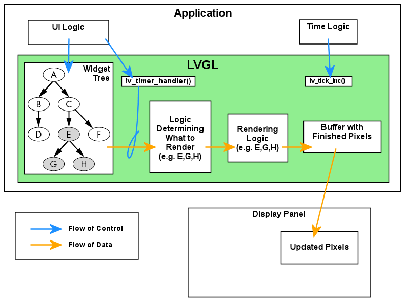
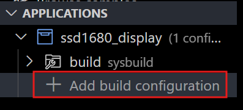
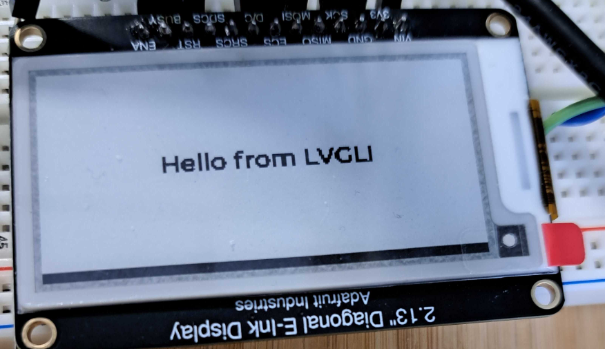
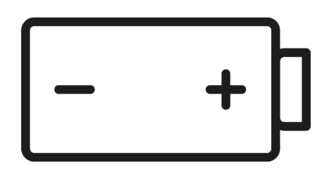
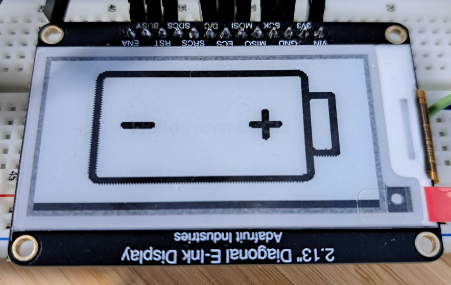

# Setting up the SSD1680 e-paper with LVGL and Zephyr

## Table of Contents

- [Setting up the SSD1680 e-paper with LVGL and Zephyr](#setting-up-the-ssd1680-e-paper-with-lvgl-and-zephyr)
  - [Table of Contents](#table-of-contents)
  - [Target Stack](#target-stack)
  - [Overview](#overview)
  - [Project Objectives](#project-objectives)
  - [Hardware \& wiring](#hardware--wiring)
  - [How the pieces fit](#how-the-pieces-fit)
  - [Project Structure](#project-structure)
  - [Creating the Overlay](#creating-the-overlay)
    - [Selecting the Chosen Display](#selecting-the-chosen-display)
    - [MIPI DBI](#mipi-dbi)
    - [Defining the ePaper's Frame Buffer](#defining-the-epapers-frame-buffer)
    - [Key Zephyr Files for SSD16xx Displays](#key-zephyr-files-for-ssd16xx-displays)
    - [SPI Bus and Pin Configuration](#spi-bus-and-pin-configuration)
    - [Full Overlay Code](#full-overlay-code)
  - [Setting Up the Configuration](#setting-up-the-configuration)
    - [Full `prj.conf` file](#full-prjconf-file)
    - [Common Questions / gotchas](#common-questions--gotchas)
  - [`main.c`](#mainc)
    - [How LVGL -\> Zephyr -\> SSD1680 are connected](#how-lvgl---zephyr---ssd1680-are-connected)
    - [The `flush` callback: what it does and why](#the-flush-callback-what-it-does-and-why)
    - [Implementation of `epd_flush_cb`](#implementation-of-epd_flush_cb)
    - [`flush_cb` notes](#flush_cb-notes)
    - [`rounder_cb` Description](#rounder_cb-description)
    - [How the callbacks tie back to the overlay](#how-the-callbacks-tie-back-to-the-overlay)
    - [Basic Hello World `main.c`](#basic-hello-world-mainc)
    - [Notes on `main.c`](#notes-on-mainc)
    - [Initaliztion steps](#initaliztion-steps)
  - [Building Application and Flashing Board](#building-application-and-flashing-board)
  - [Adding Images to the Project](#adding-images-to-the-project)
  - [Adding the Image to `main.c`](#adding-the-image-to-mainc)

---


## Target Stack

- Development Board: nRF52840DK (compatible with other nordic dev boards with changes to pin assignments)
- Toolchain: Zephyr/NCS v3.0.2 + LVGL v9
- e-paper display: Adafruit 2.13" ePaper Display https://www.adafruit.com/product/4197

## Overview
This tutorial walks through connecting a ssd1680 ePaper device to a nordic NRF dev board

## Project Objectives

- A minimal LVGL v9 app in 1-bit mode
- A custom flush callback that converts LVGL's horizontal 1-bpp data into the SSD16xx vertical-tiled format
- A rounder callback so LVGL only draws byte-aligned areas
- A label and a logo bitmap, with examples of partial and full refresh cycles

## Hardware & wiring

**EPD (SSD1680) on SPI1:**

| Signal | nRF52840DK pin |
|--------|----------------|
| SCK    | P1.10          |
| MOSI   | P1.11          |
| CS     | P1.12          |
| D/C    | P1.13          |
| RST    | P1.14          |
| BUSY   | P1.15          |

The panel is physically 250×122, but the Zephyr SSD16xx driver uses 256×128 internal alignment (bytes/tiles). We’ll declare a logical 256×128 to keep everything byte aligned and clip the part that overhangs the physical glass.

## How the pieces fit

LVGL v9 draws into a buffer in I1 (1-bit) horizontal format, MSB-first, with a fixed stride equal to the logical width. For I1, LVGL reserves 8 bytes at the start of the buffer for a palette.

Zephyr’s display API calls our `flush_cb(disp, area, px_map)` whenever LVGL wants pixels sent to the panel.

SSD16xx (SSD1680) RAM stores pixels 8 vertically per byte (vertical tiling). We convert LVGL’s horizontal bits to that vertical format in the flush callback before calling `display_write()`.

Partial vs full updates: if you flush a sub-rectangle, the driver uses the partial waveform; if you flush the entire screen, it uses the full waveform (the overlay provides both).

## Project Structure

In VS code create a new blank project and add a `boards` folder in the top directory. In the boards folder create the overlay for your specific board.

The starting project should have this structure.

```text
ssd1680_display
├── CMakeLists.txt
├── boards
│   └── nrf52840dk_nrf52840.overlay
├── prj.conf
└── src
    └── main.c
```
## Creating the Overlay

### Selecting the Chosen Display

We start off my selecting our `epd` as the chosen node which tells Zephyr to selcet our ePaper device as the default for our display subsystem.

```dts
/ {
    chosen {
        zephyr,display = &epd;
    };
```

### MIPI DBI

In order for the host device to communicate with the display controller, we use the **Mobile Industry Processor Interface (MIPI) Display Bus Interface (DBI)**. MIPI DBI is a protocol layer on top of our SPI bus that defines how bytes are interpreted by the display controller. It specifies how to differentiate between command and data bytes, how display registers are addressed, and the required sequence of commands to initialize and control the display.

```dts
    mipi_dbi_epd: mipi_dbi_epd {
        compatible = "zephyr,mipi-dbi-spi";
        spi-dev = <&spi1>;
        dc-gpios = <&gpio1 13 GPIO_ACTIVE_HIGH>;
        reset-gpios = <&gpio1 14 GPIO_ACTIVE_LOW>;
        #address-cells = <1>;
        #size-cells = <0>;
```

### Defining the ePaper's Frame Buffer

To add our e-paper display driver in the overlay, we define a `framebuffer` device for the panel. The `SSD1680` controller is part of the `SSD16xx` family in Zephyr’s core drivers, which is why the device is named `ssd16xxfb` rather than `ssd1680fb`. In Zephyr, the SSD16xx framebuffer driver supports multiple controller variants (SSD1606, SSD1675, SSD1680, etc.), so the name reflects the family, not the specific model.

The compatible field follows the syntax `<vendor>,<device>`, giving us `solomon,ssd1680` for this controller.

We also specify the display’s logical `width` and `height`, rounded up to the nearest multiple of 8 so that the `framebuffer` data is byte-aligned.

The `tssv` property corresponds to a register in the `SSD1680` that selects which waveform table to use from the controller’s internal memory. E-paper displays require a specific sequence of voltage pulses to rearrange the charged pigment particles in the panel for the desired image. These sequences; called waveforms, control the transition behavior, ghosting reduction, and update speed.

In addition, we define border waveforms for full and partial refreshes. Full refresh waveforms clear and redraw the entire panel, while partial refresh waveforms are optimized for updating smaller regions more quickly. Together, the tssv setting and the selected border waveforms determine exactly how the panel updates.


```dts
   epd: ssd16xxfb@0 {
            compatible = "solomon,ssd1680";
            status = "okay";
            reg = <0>;
            label = "EPD0";

            /* REQUIRED / USED BY DRIVER */
            width = <256>;
            height = <128>;
            rotation = <0>;
            busy-gpios = <&gpio1 15 GPIO_ACTIVE_HIGH>;
            mipi-max-frequency = <4000000>;

            /* Optional SSD16xx specifics */
            tssv = <0x80>;

            /* Use partial waveform for small-area updates (label only) */
            partial { };
            /* If you later want to tweak border behavior you can also define:
             * full    { border-waveform = <0x00>; };
             * partial { border-waveform = <0x00>; };
             */
        };
```

### Key Zephyr Files for SSD16xx Displays
More information on the SSD16xx family can be found in two places in NCS v3.0.2:

1. Driver source code -> located in
`zephyr/drivers/display/ssd16xx.c` (and related files).
This contains the C implementation of the driver logic, including SPI transactions, waveform handling, and integration with Zephyr’s display API.

2. Devicetree bindings -> located in the `zephyr/dts/bindings/display` directory:

- `solomon,ssd16xx-common.yaml` -> Defines properties that are shared across all SSD16xx-based displays (e.g., `tssv`, `border-waveform`, `busy-gpios`).

- `solomon,ssd16xxfb.yaml` -> Extends the common binding with properties specific to the framebuffer driver (`ssd16xxfb`), such as `width`, `height`, and `mipi-max-frequency`.

Zephyr uses solomon,`ssd16xxfb.yaml` as the actual compatible target in your overlay, but it includes the definitions from `solomon,ssd16xx-common.yaml` so that shared properties don’t have to be redefined in every variant.

### SPI Bus and Pin Configuration

The following section enables spi1 for use with our e-paper display and configures its chip select line and pin assignments:

```dts
&spi1 {
    status = "okay";
    cs-gpios = <&gpio1 12 GPIO_ACTIVE_LOW>;
    pinctrl-0 = <&spi1_default>;
    pinctrl-1 = <&spi1_sleep>;
    pinctrl-names = "default", "sleep";
};

&pinctrl {
    spi1_default: spi1_default {
        group1 {
            psels = <NRF_PSEL(SPIM_SCK, 1, 10)>,
                    <NRF_PSEL(SPIM_MOSI, 1, 11)>;
        };
    };

    spi1_sleep: spi1_sleep {
        group1 {
            psels = <NRF_PSEL(SPIM_SCK, 1, 10)>,
                    <NRF_PSEL(SPIM_MOSI, 1, 11)>;
            low-power-enable;
        };
    };
};
```

- `status = "okay";` -> Activates the spi1 peripheral in the devicetree.
- `cs-gpios` -> Defines the GPIO used for chip select (here, GPIO1 pin 12, active low).
- `pinctrl-0` / `pinctrl-1` -> Assign the pin control groups for default operation and low-power (sleep) mode.
- `pinctrl-names` -> Names the two configurations "default" and "sleep" so the driver can switch between them.

### Full Overlay Code

```dts
#include <zephyr/dt-bindings/gpio/gpio.h>

/ {
    chosen {
        zephyr,display = &epd;
    };


    mipi_dbi_epd: mipi_dbi_epd {
        compatible = "zephyr,mipi-dbi-spi";
        spi-dev = <&spi1>;
        dc-gpios = <&gpio1 13 GPIO_ACTIVE_HIGH>;
        reset-gpios = <&gpio1 14 GPIO_ACTIVE_LOW>;
        #address-cells = <1>;
        #size-cells = <0>;

        epd: ssd16xxfb@0 {
            compatible = "solomon,ssd1680";
            status = "okay";
            reg = <0>;
            label = "EPD0";

            /* REQUIRED / USED BY DRIVER */
            width = <256>;
            height = <128>;
            rotation = <0>;
            busy-gpios = <&gpio1 15 GPIO_ACTIVE_HIGH>;
            mipi-max-frequency = <4000000>;

            /* Optional SSD16xx specifics */
            tssv = <0x80>;

            /* Use partial waveform for small-area updates (label only) */
            partial { };
            /* If you later want to tweak border behavior you can also define:
             * full    { border-waveform = <0x00>; };
             * partial { border-waveform = <0x00>; };
             */
        };
    };
};

&spi1 {
    status = "okay";
    cs-gpios = <&gpio1 12 GPIO_ACTIVE_LOW>;
    pinctrl-0 = <&spi1_default>;
    pinctrl-1 = <&spi1_sleep>;
    pinctrl-names = "default", "sleep";
};

&pinctrl {
    spi1_default: spi1_default {
        group1 {
            psels = <NRF_PSEL(SPIM_SCK, 1, 10)>,
                    <NRF_PSEL(SPIM_MOSI, 1, 11)>;
        };
    };

    spi1_sleep: spi1_sleep {
        group1 {
            psels = <NRF_PSEL(SPIM_SCK, 1, 10)>,
                    <NRF_PSEL(SPIM_MOSI, 1, 11)>;
            low-power-enable;
        };
    };
};
```

## Setting Up the Configuration

The `prj.conf` file defines the Kconfig options used when building this project. These options control which Zephyr subsystems and LVGL features are included, how much memory is allocated, and how peripherals like SPI and GPIO are configured for the SSD1680 e-paper display.

**Compatibility note:** Some configuration options available in newer versions of Zephyr’s LVGL are not present in NCS v3.0.2. The settings shown here are the ones that worked for me while developing on NCS v3.0.2.


### Full `prj.conf` file

```.conf
# ── Low-level IO
CONFIG_GPIO=y
CONFIG_SPI=y
CONFIG_SPI_NRFX=y

# ── Display
CONFIG_DISPLAY=y
CONFIG_SSD16XX=y

# ── LVGL (manual init)
CONFIG_LVGL=y
CONFIG_LV_Z_AUTO_INIT=n
CONFIG_LV_Z_BITS_PER_PIXEL=1
CONFIG_LV_Z_MEM_POOL_SIZE=24576
CONFIG_LV_USE_LABEL=y
CONFIG_LV_USE_THEME_DEFAULT=y

# ── Logging (handy while bring-up)
CONFIG_LOG=y
CONFIG_LV_USE_LOG=y
CONFIG_LV_LOG_LEVEL_INFO=y
CONFIG_DISPLAY_LOG_LEVEL_DBG=y

# ── libc + float printf (we’ll still format as integers for safety)
CONFIG_NEWLIB_LIBC=y
CONFIG_NEWLIB_LIBC_NANO=y
CONFIG_NEWLIB_LIBC_FLOAT_PRINTF=y
CONFIG_CBPRINTF_FP_SUPPORT=y

# ── Stacks / safety
CONFIG_HW_STACK_PROTECTION=y
CONFIG_MAIN_STACK_SIZE=24576

```

### Common Questions / gotchas

*“Why 1-bit color?”*

- E-paper is monochrome; 1bpp reduces RAM and transfer time. LVGL supports it and will dither/threshold if needed.

*“No MISO in pinctrl?”*

- SSD1680 over DBI Type-C is effectively write-only. It’s normal to set only SCK and MOSI.

*“Partial refresh”*

- Handled by the SSD16xx driver when you flush a sub-rectangle. Your overlay’s partial/full nodes + tssv pick the waveforms.

*“My build can’t find LVGL font or object symbols”*

- Names vary slightly across SDK versions. If a symbol doesn’t exist, open menuconfig (west build -t menuconfig) -> Modules -> LVGL and enable any small font (e.g., a Montserrat or unscii font) and at least one object (label is a good start). The exact Kconfig names shown there will be correct for your tree.

## `main.c`

### How LVGL -> Zephyr -> SSD1680 are connected

1. From the Overlay to a Zephyr Device

In the overlay we declared:

```dts
/ { chosen { zephyr,display = &epd; }; };

&spi1 { /* ... */ };

epd: ssd16xxfb@0 {
    compatible = "solomon,ssd1680";
    /* width/height, tssv, waveforms, busy-gpios, etc. */
};
```

At boot, Zephyr binds the `ssd16xxfb` driver to the `epd` node and exposes it as a `struct device` this is usefull since we can abtract away the device driver implmentation from our source code allowing us to simply modify our overlay if we are using a different e-paper without having to modify our `main.c`

In `main.c` we get the device struct with:

```c
const struct device *display_dev = DEVICE_DT_GET(DT_CHOSEN(zephyr_display));
```

This returns an instance of the driver containing our configurations defined in the overlay file

2. From Zephyr device to LVGL display object

We create a display which requires our display's resolution, color format, and buffer information

```c
 lv_display_set_color_format(disp, LV_COLOR_FORMAT_I1);
    lv_display_set_user_data(disp, (void *)display_dev);
    lv_display_set_buffers(disp, draw_buf, NULL, sizeof(draw_buf),
                           LV_DISPLAY_RENDER_MODE_PARTIAL);
```
The Zephyr device pointer is placed inside the LVGL display object so the flush callback can reach it

```c
lv_display_set_user_data(disp, (void *)display_dev);
```

So now we can assign the display to our flush and event callbacks

```c
lv_display_set_flush_cb(disp, epd_flush_cb);
lv_display_add_event_cb(disp, rounder_cb, LV_EVENT_INVALIDATE_AREA, disp);

```

### The `flush` callback: what it does and why

Purpose: This function takes the rectangle of pixels LVGL renders into `draw_buf` and pushes only that region to the hardware, respecting the controller's memory layout and the panel's quirks.

**Key Points**

- We configured LVGL to render 1-bit pixes using `LV_COLOR_FORMAT_I1`. These pixels are horizontally packed, MSB-first, with a full-width stride of of `PANEL_HOR_RES` (256)
- The SSD16xx controllers store RAM in vertical tiles (`SCREEN_INFO_MONO_VTILTED`), meaning each byte = 8 vertical pixels (MSB is top)
- The physical glass is 250x122, but 256x128 are exposed to LVGL for byte alingment, so we must clip to 250x122 when sending

### Implementation of `epd_flush_cb`

```c
/* ------- EPD flush: LVGL I1 -> SSD16xx vertical-tiling ------- */
static void epd_flush_cb(lv_display_t *disp, const lv_area_t *area, uint8_t *px_map)
{
    const struct device *dev = (const struct device *)lv_display_get_user_data(disp);

    /* Skip 8-byte palette for I1 */
    px_map += 8;

    /* Clip to physical (250x122) */
    lv_coord_t x1 = area->x1, y1 = area->y1, x2 = area->x2, y2 = area->y2;
    if (x2 >= 250) x2 = 249;
    if (y2 >= 122) y2 = 121;
    uint16_t w = (uint16_t)(x2 - x1 + 1);
    uint16_t h = (uint16_t)(y2 - y1 + 1);

    /* Convert to vertical-tiling */
    static uint8_t vtbuf[PANEL_HOR_RES * ((PANEL_VER_RES + 7) / 8)];
    uint16_t groups = (h + 7U) >> 3;

    for (uint16_t gx = 0; gx < w; gx++) {
        for (uint16_t gy = 0; gy < groups; gy++) {
            uint8_t out_byte = 0;
            for (uint8_t bit = 0; bit < 8; bit++) {
                uint16_t row = gy * 8U + bit;
                uint8_t bit_val = 0;
                if (row < h) {
                    lv_coord_t px = x1 + gx;
                    lv_coord_t py = y1 + row;
                    uint32_t idx = (uint32_t)py * PANEL_HOR_RES + px;
                    uint32_t byte_index = idx >> 3;
                    uint8_t bit_off = idx & 0x7;
                    bit_val = (px_map[byte_index] >> (7 - bit_off)) & 1U;
                }
                if (bit_val) out_byte |= (1U << (7 - bit));
            }
            vtbuf[gy * w + gx] = out_byte;
        }
    }

    struct display_buffer_descriptor desc = {
        .buf_size = w * groups,
        .width = w,
        .pitch = w,
        .height = (uint16_t)(groups * 8U),
    };

    int ret = display_write(dev, x1, y1, &desc, vtbuf);
    if (ret) {
        printk("display_write() failed: %d\n", ret);
    }

    lv_display_flush_ready(disp);
}

```

### `flush_cb` notes

- Palette skip (8 bytes): LVGL reserves a small header for I1; if it is not skipped, your top row get corrupted
- Clipping: Prevents accidental writes beyond 250x122 (physical panel size) even though LVGL believes 256x128 exits
- Vertical-tiling convert: Matches the controller’s memory format; without this, content appears scrambled or interleaved.
- Descriptor `width/pitch/height`: Must correspond to the converted buffer layout; for VTILED displays, `height` is rounded up to a multiple of 8
- For partial refresh: LVGL passes only the area that changed

### `rounder_cb` Description

This function Makes LVGL's invalidate/flush rectangles line up with the hardware's memory granularity so the 1-bit VTILED assumptions hold and we prevent "bit smearing"

```c

/* Align flush areas to 8px boundaries (I1 byte alignment) */
static void rounder_cb(lv_event_t *e)
{
    lv_area_t *a = (lv_area_t *)lv_event_get_param(e);
    a->x1 &= ~0x7;
    a->x2 |= 0x7;
    if (a->x2 >= PANEL_HOR_RES) a->x2 = PANEL_HOR_RES - 1;
    /* y alignment not required for I1; keep as-is to minimize area */
}

```

This ensures the following
- Horizontal byte alingment: Since LVGL's source buffer `px_map` is horizontal 1bpp (8 pixels per byte), forcing `x1` to a multiple of 8 and `x2` to somewhere between 0 and 7 ensures the region you read from is composed of full bytes. This:
-- Simplifies bit extraction
--Avoids reading partial bytes at the edges
-- Prevents corruption when LVGL asks to flush a narrow, odd-aligned rectangle
- Vertical alingment: handled in `flush_cb`

### How the callbacks tie back to the overlay
1. Overlay sets bus/pins/waveforms and names the display via `label = "epd"`; `chosen { zephyr,display = &epd; } makes it the default
2. Zephyr binds the `ssd16xxfb` driver to that node and exposes it as a `struct device *(display_dev)`
3. In the application code
- This creates an LVGL display `(lv_display_create(...))` with logical `256x128` and `I1` format
- Stashes `display_dev` as user_data on the LVGL display
- Registers `rounder_cb` to align LVGLs rectangles and `epd_flush_cb` to do the conversion and call `display_write()` with the proper buffer descriptor
- The SSD16xx driver chooses partial/full waveforms (defined in the overlay) depending on the region and update, and toggles the `busy` pin appropriately

### Basic Hello World `main.c`

```c
#include <zephyr/kernel.h>
#include <zephyr/device.h>
#include <zephyr/devicetree.h>
#include <zephyr/drivers/display.h>
#include <zephyr/sys/printk.h>
#include <lvgl.h>

/* Logical LVGL resolution (must be multiple of 8 for I1) */
#define PANEL_HOR_RES 256U
#define PANEL_VER_RES 128U

/* LVGL draw buffer: +8 bytes palette for I1 */
#define DRAW_BUF_SIZE (((PANEL_HOR_RES * PANEL_VER_RES) / 8U) + 8U)
static uint8_t draw_buf[DRAW_BUF_SIZE];

/* ------- EPD flush: LVGL I1 -> SSD16xx vertical-tiling ------- */
static void epd_flush_cb(lv_display_t *disp, const lv_area_t *area, uint8_t *px_map)
{
        const struct device *dev = (const struct device *)lv_display_get_user_data(disp);

        /* Skip 8-byte palette for I1 */
        px_map += 8;

        /* Clip to physical (250x122) */
        lv_coord_t x1 = area->x1, y1 = area->y1, x2 = area->x2, y2 = area->y2;
        if (x2 >= 250)
                x2 = 249;
        if (y2 >= 122)
                y2 = 121;
        uint16_t w = (uint16_t)(x2 - x1 + 1);
        uint16_t h = (uint16_t)(y2 - y1 + 1);

        /* Convert to vertical-tiling */
        static uint8_t vtbuf[PANEL_HOR_RES * ((PANEL_VER_RES + 7) / 8)];
        uint16_t groups = (h + 7U) >> 3;

        for (uint16_t gx = 0; gx < w; gx++)
        {
                for (uint16_t gy = 0; gy < groups; gy++)
                {
                        uint8_t out_byte = 0;
                        for (uint8_t bit = 0; bit < 8; bit++)
                        {
                                uint16_t row = gy * 8U + bit;
                                uint8_t bit_val = 0;
                                if (row < h)
                                {
                                        lv_coord_t px = x1 + gx;
                                        lv_coord_t py = y1 + row;
                                        uint32_t idx = (uint32_t)py * PANEL_HOR_RES + px;
                                        uint32_t byte_index = idx >> 3;
                                        uint8_t bit_off = idx & 0x7;
                                        bit_val = (px_map[byte_index] >> (7 - bit_off)) & 1U;
                                }
                                if (bit_val)
                                        out_byte |= (1U << (7 - bit));
                        }
                        vtbuf[gy * w + gx] = out_byte;
                }
        }

        struct display_buffer_descriptor desc = {
            .buf_size = w * groups,
            .width = w,
            .pitch = w,
            .height = (uint16_t)(groups * 8U),
        };

        int ret = display_write(dev, x1, y1, &desc, vtbuf);
        if (ret)
        {
                printk("display_write() failed: %d\n", ret);
        }

        lv_display_flush_ready(disp);
}

/* Align flush areas to 8px boundaries (I1 byte alignment) */
static void rounder_cb(lv_event_t *e)
{
        lv_area_t *a = (lv_area_t *)lv_event_get_param(e);
        a->x1 &= ~0x7;
        a->x2 |= 0x7;
        if (a->x2 >= PANEL_HOR_RES)
                a->x2 = PANEL_HOR_RES - 1;
        /* y alignment not required for I1; keep as-is to minimize area */
}

/* LVGL tick from Zephyr uptime (ms) */
static uint32_t my_tick_get(void) { return (uint32_t)k_uptime_get(); }

int main(void)
{
        const struct device *display_dev = DEVICE_DT_GET(DT_CHOSEN(zephyr_display));
        if (!device_is_ready(display_dev))
        {
                printk("Display device not ready\n");
                return;
        }

        /* LVGL init */
        lv_init();
        lv_tick_set_cb(my_tick_get);

        /* LVGL display setup: PARTIAL render mode so only invalidated areas flush */
        lv_display_t *disp = lv_display_create(PANEL_HOR_RES, PANEL_VER_RES);
        if (!disp)
        {
                printk("Failed to create LVGL display\n");
                return;
        }
        lv_display_set_color_format(disp, LV_COLOR_FORMAT_I1);
        lv_display_set_user_data(disp, (void *)display_dev);
        lv_display_set_buffers(disp, draw_buf, NULL, sizeof(draw_buf),
                               LV_DISPLAY_RENDER_MODE_PARTIAL); /* <-- key */

        lv_display_set_flush_cb(disp, epd_flush_cb);
        lv_display_add_event_cb(disp, rounder_cb, LV_EVENT_INVALIDATE_AREA, disp);

        display_blanking_off(display_dev);

        /* Simple demo UI */
        lv_obj_t *label = lv_label_create(lv_screen_active());
        lv_label_set_text(label, "Hello from LVGL!");
        lv_obj_center(label);

        /* LVGL tick/handler loop */
        while (true)
        {
                lv_timer_handler();
                k_msleep(50);
        }
        return 0;
}

```

### Notes on `main.c`

Attemting to auto initalize lvlg caused my application to crash which is why I chose to manually initalize LVLG. The process of including lvlg into the application can be found in their documentation here:https://docs.lvgl.io/master/details/integration/adding-lvgl-to-your-project/connecting_lvgl.html




### Initaliztion steps

1. **Initialize LVGL**

Call `lv_init()` once at the very beginning of your application. This sets up LVGL’s core structures. No other LVGL calls are valid until this runs.

2. **Initialize the display driver**

Retrieve the display device from the devicetree and verify it is ready.

```c
 const struct device *display_dev = DEVICE_DT_GET(DT_CHOSEN(zephyr_display));
        if (!device_is_ready(display_dev))
        {
                printk("Display device not ready\n");
                return;
        }
```

3. **Provide a system tick to LVGL**

LVGL requires a millisecond time base for its internal timers and animations.
Define a tick function using Zephyr’s uptime counter:

```c
static uint32_t my_tick_get(void) { return (uint32_t)k_uptime_get(); }
```

Which we link to LVLG using

```c
lv_tick_set_cb(my_tick_get);
```

4. **Register the display interface**

Create an LVGL display object, set its format and buffers, and register callbacks for flushing and alignment.

```c
/* LVGL display setup: PARTIAL render mode so only invalidated areas flush */
        lv_display_t *disp = lv_display_create(PANEL_HOR_RES, PANEL_VER_RES);
        if (!disp)
        {
                printk("Failed to create LVGL display\n");
                return;
        }
        lv_display_set_color_format(disp, LV_COLOR_FORMAT_I1);
        lv_display_set_user_data(disp, (void *)display_dev);
        lv_display_set_buffers(disp, draw_buf, NULL, sizeof(draw_buf),
                               LV_DISPLAY_RENDER_MODE_PARTIAL); /* <-- key */

        lv_display_set_flush_cb(disp, epd_flush_cb);
        lv_display_add_event_cb(disp, rounder_cb, LV_EVENT_INVALIDATE_AREA, disp);

        display_blanking_off(display_dev);
```
5. **Skip input devices**

Since the e-paper panel has no touch input, we omit this step.

6. **DRun the LVGL task handler loop**

LVGL needs to periodically process timers and events. Call `lv_timer_handler()` every few milliseconds in your main loop:

```c
    while (true)
        {
                lv_timer_handler();
                k_msleep(50);
        }
```
7. **Create UI objects**
Once initialized, you can create LVGL objects such as labels, buttons, or images:

```c
        /* Simple demo UI */
        lv_obj_t *label = lv_label_create(lv_screen_active());
        lv_label_set_text(label, "Hello from LVGL!");
        lv_obj_center(label);
```

The full project up to this point can be found here:`epd_tutorials/epd_hello_world`


## Building Application and Flashing Board

To build the application use the **Add build configuration** option under the **APPLICATIONS** window in the nRF-Connect extention



In the build configuration wizard select the board you are using and add your overlay file to the **Extra Devicetree Overlays** dropdown list

Select **Generate and Build** at the bottom of the wizard

After the build completes you can flash the board by selecting **Flash** under the **Actions** window in the nRF-Connect extention

The display will show "Hello from LVGL!" if the programming was sucsessful.




## Adding Images to the Project

In order to add a images to the display we first need to convert our image into a bitmap. LVLG has a python script avalible that will generate a c file to store the image data: https://github.com/lvgl/lvgl/blob/master/scripts/LVGLImage.py

The script relies on pypng package which we can donload using
```cmd
py -3 -m pip install pypng lz4
```

With our resized image in the same folder as the python scipt we can run the Image converter with the following arguments.

```cmd
py -3 .\LVGLImage.py `
  --ofmt C `
  --cf I1 `
  --output .\out `
  --name Battery_Resized `
  .\Battery_Resized.png

```

For this example I am using a battery symbol



The script will place your image in an `out` folder in the same directory you ran the scrip. Place it inside your `/src` folder

More information on images can be found in the LVGL documation in: https://docs.lvgl.io/master/details/main-modules/image.html

## Adding the Image to `main.c`

To add our Image to our `main.c` we need to include the c file into our project with the rest of our includes.

**Note:** In order to get my project to build I needed to change the #include on line 9 of Battery_Resized.h from "lvgl/lvgl.h" to "lvgl.h"

```c
#include Battery_Resized.c
```

This snippet demonstrates how to bring up the e-paper display and display an image

1. **Include the image .c file in your `main.c`**

```c
#include "Battery_Resized.c"

```

2. **Create the battery image object**

We comment out the "Hello from LVLG" block and replace it with the image object below.

- References an external image descriptor (Battery_Resized) that was converted using the LVGL image converter.
- Creates an LVGL image widget on the active screen.
- Sets the image source to the Battery_Resized asset.
- Centers the image on the display, replacing the label.

```c
extern const lv_image_dsc_t Battery_Resized;
lv_obj_t *img = lv_image_create(lv_screen_active());
lv_image_set_src(img, &Battery_Resized);
lv_obj_center(img);
```

Building and flashing the board should show the battery icon.



