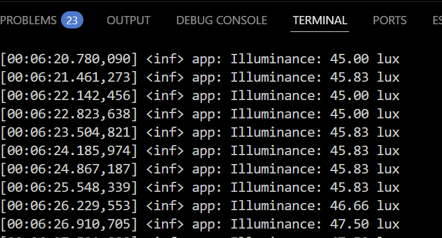
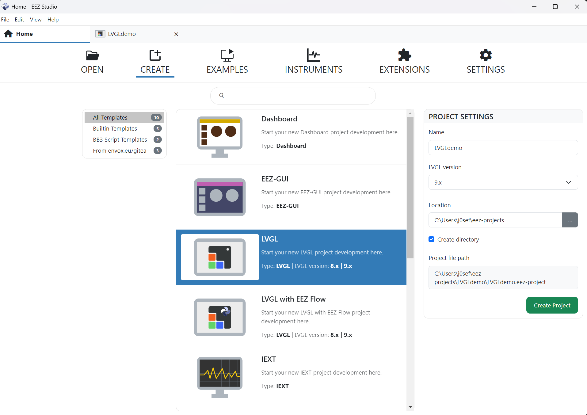
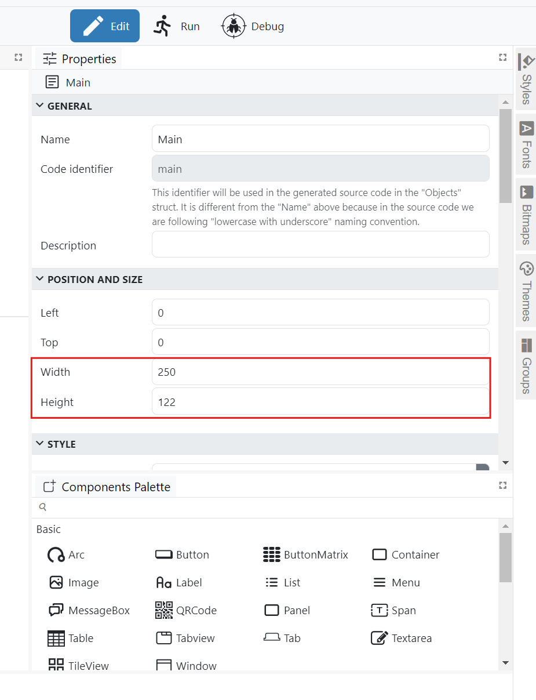
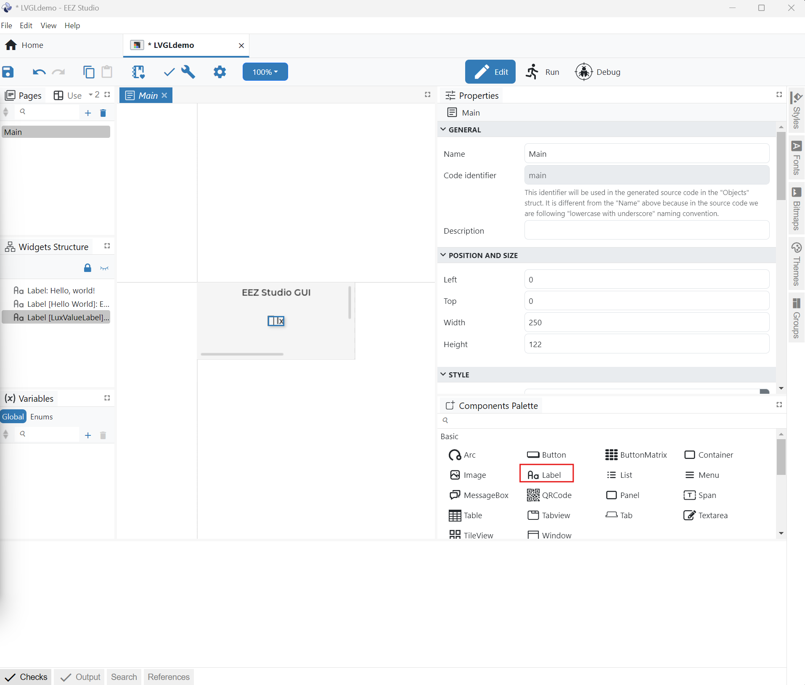
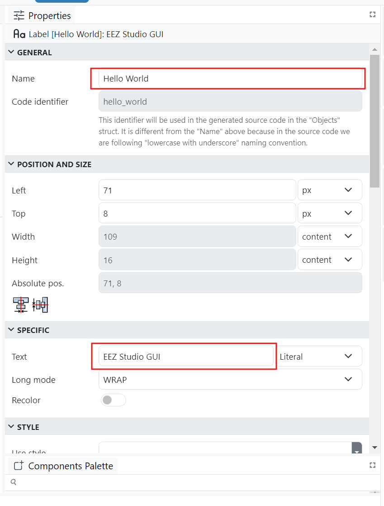
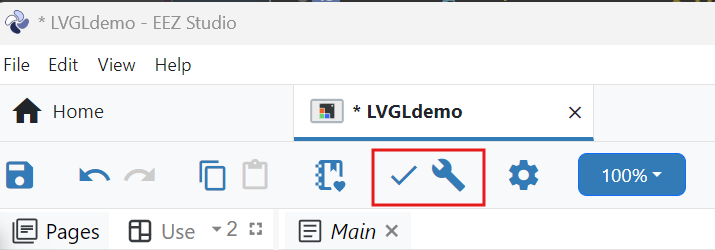
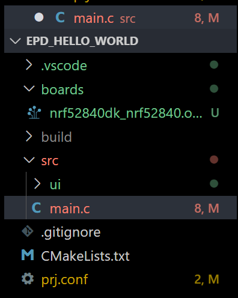
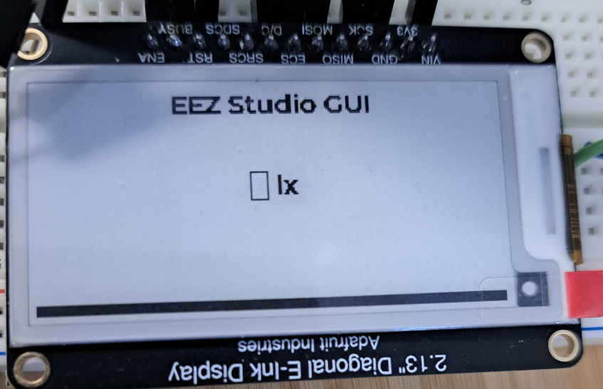
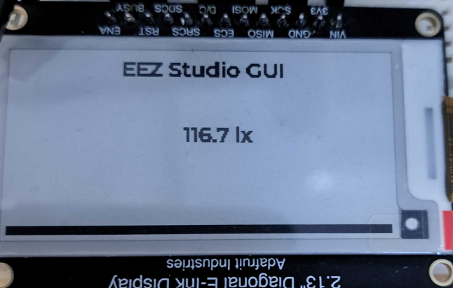

# EEZ Studo/Epaper Tutorial

This tutorial will cover using EEZ Studio to generate a UI that we can export into our project. We will add learn how to add EEZ Studio files to our project, and add a label to display lux sensor data from a bh1750.

## Prequisites
- The starting point for this project is the `epd_hello_world` example found at `zephyr-projects/epd_tutorials/epd_hello_world`
- BH1750 Light Sensor
- Download EEZ Studio: https://www.envox.eu/studio/studio-introduction/ 

### Note on Finding Sensor/I2C Info

If you need to find information such as the compatable tag and sensor functions you can look up the bindings file for the specifc sensor which is contained in `zephyr/dts/bindings/sensor`. The default I2C pins can be found in `zephyr/boards/<board mfg>/<board.dtsi>`

Here is the additional test code I used to test the sensor. 

I added the I2C and sensor config symbols to the prj.conf

```.conf
# ─────────────────────────────
# I2C for reading lux sensor
# ─────────────────────────────

CONFIG_I2C=y
CONFIG_SENSOR=y
CONFIG_BH1750=y
```

Next I updated the device dree overlay
```dts
#include <zephyr/dt-bindings/gpio/gpio.h>

/ {
    chosen {
        zephyr,display = &epd;
    };

    aliases {
        light0 = &lux_sensor;
    };

    mipi_dbi_epd: mipi_dbi_epd {
        compatible = "zephyr,mipi-dbi-spi";
        spi-dev = <&spi1>;
        dc-gpios = <&gpio1 13 GPIO_ACTIVE_HIGH>;
        reset-gpios = <&gpio1 14 GPIO_ACTIVE_LOW>;
        #address-cells = <1>;
        #size-cells = <0>;

        epd: ssd16xxfb@0 {
            compatible = "solomon,ssd1680";
            status = "okay";
            reg = <0>;
            label = "EPD0";

            /* REQUIRED / USED BY DRIVER */
            width = <256>;
            height = <128>;
            rotation = <0>;
            busy-gpios = <&gpio1 15 GPIO_ACTIVE_HIGH>;
            mipi-max-frequency = <4000000>;

            /* Optional SSD16xx specifics */
            tssv = <0x80>;

            /* Use partial waveform for small-area updates (label only) */
            partial { };
            /* If you later want to tweak border behavior you can also define:
             * full    { border-waveform = <0x00>; };
             * partial { border-waveform = <0x00>; };
             */
        };
    };
};

&spi1 {
    status = "okay";
    cs-gpios = <&gpio1 12 GPIO_ACTIVE_LOW>;
    pinctrl-0 = <&spi1_default>;
    pinctrl-1 = <&spi1_sleep>;
    pinctrl-names = "default", "sleep";
};

&pinctrl {
    spi1_default: spi1_default {
        group1 {
            psels = <NRF_PSEL(SPIM_SCK, 1, 10)>,
                    <NRF_PSEL(SPIM_MOSI, 1, 11)>;
        };
    };

    spi1_sleep: spi1_sleep {
        group1 {
            psels = <NRF_PSEL(SPIM_SCK, 1, 10)>,
                    <NRF_PSEL(SPIM_MOSI, 1, 11)>;
            low-power-enable;
        };
    };
};

&i2c0 {
    status = "okay";
    pinctrl-0 = <&i2c0_default>;
    pinctrl-1 = <&i2c0_sleep>;
    pinctrl-names = "default", "sleep";

    lux_sensor: bh1750@23 {
        compatible = "rohm,bh1750";
        reg = <0x23>;              /* or 0x5C if ADDR is pulled high */
        label = "BH1750";
        status = "okay";
        // power-gpios = <&gpio1 16 GPIO_ACTIVE_HIGH>; /* optional */
    };
};

&pinctrl {
    /omit-if-no-ref/ i2c0_default: i2c0_default {
        group1 {
            psels = <NRF_PSEL(TWIM_SCL, 0, 26)>,  /* SCL = P0.26 */
                    <NRF_PSEL(TWIM_SDA, 0, 27)>;  /* SDA = P0.27 */
        };
    };

    /omit-if-no-ref/ i2c0_sleep: i2c0_sleep {
        group1 {
            psels = <NRF_PSEL(TWIM_SCL, 0, 26)>,
                    <NRF_PSEL(TWIM_SDA, 0, 27)>;
            low-power-enable;
        };
    };
};

```

And I made a test main.c to check if the sensor was working as expected
```c
#include <zephyr/kernel.h>
#include <zephyr/device.h>
#include <zephyr/drivers/sensor.h>
#include <zephyr/logging/log.h>

LOG_MODULE_REGISTER(app, LOG_LEVEL_INF);

/* Alias from your overlay: aliases { light0 = &lux_sensor; }; */
#define BH1750_NODE DT_ALIAS(light0)

void main(void)
{
    const struct device *dev = DEVICE_DT_GET(BH1750_NODE);
    if (!device_is_ready(dev)) {
        LOG_ERR("BH1750 device not ready");
        return;
    }

    /* If you power the sensor via a GPIO, consider a 10–20 ms delay here */

    while (1) {
        int rc = sensor_sample_fetch(dev);
        if (rc) {
            LOG_ERR("sample_fetch failed (%d)", rc);
        } else {
            struct sensor_value lux;
            rc = sensor_channel_get(dev, SENSOR_CHAN_LIGHT, &lux);
            if (!rc) {
                LOG_INF("Illuminance: %.2f lux", sensor_value_to_double(&lux));
            } else {
                LOG_ERR("channel_get failed (%d)", rc);
            }
        }
        k_sleep(K_MSEC(500));
    }
}

```

After building and flashing the serial output should look like this 



Next we will incorperate the Lux sensor output into our existing main code by creating a label to contain the lux sensor data and update it every minute. 

## Creating a Basic UI in EEZ Studio

### Create a New Project

Once EEZ studio is installed, open it and create a new LVGL project, name the project `LVGLdemo`, selsect version `9.x` and set the project directory.



We fist need to set the size of our display, on the right hand side of the eidtor under the `Main` page section we can set the width to 250 and height to 122 to match our Epaper's resolution.



The previw window will resize to match the resolution of our screen.

For an inital test we will create two labels, one as a title and one to display our lux values. Under the Style window you can select the LVGL widgets you want to add to the project, select the Label widget and drag it to the top middle of your display canvas, add Another labble in the center. 




We can edit the text and name of the label from the propreties pannel. We name the first label `Hello World` and specify the text to be `EEZ Studio GUI`. The second label will be nammed `LuxValueLabel` and the text will be initalized as `— lx`



To verify that there are no issues with our UI we click the checkmark on the top tool bar, if there are no issues we can select the wrench to build the project. The build will create a `scr/ui` folder (location specifed in project creation) that contains the nessicary files to be imported into our project.



## Add EEZ to Project

Once you have located the `ui` folder drag it into your `src` folder in VS code




EEZ Studio assumes we are using the upstream LVGL repo structure when generating the ui files, we need to change the include path for the ui files from `<lvgl/lvgl.h>` to `<lvgl.h>` in order to build our project. Go through the files in the `ui` folder and replace the include paths for lvgl.

We also need to tell our top level CMakeLists.txt to include the `ui` folder in the build process. Here is the updated CMakeLIStS.txt to implement this.

```CMake
cmake_minimum_required(VERSION 3.20.0)
find_package(Zephyr REQUIRED HINTS $ENV{ZEPHYR_BASE})

project(epd_hello_world)

target_sources(app PRIVATE src/main.c)

# === UI sources ===
# Use forward slashes with CMake (works on Windows too)
set(UI_DIR ${CMAKE_CURRENT_SOURCE_DIR}/src/ui)

# Grab everything in src/ui (recursively); CONFIGURE_DEPENDS re-globs on file changes
file(GLOB_RECURSE UI_SOURCES CONFIGURE_DEPENDS
  ${UI_DIR}/*.c
  ${UI_DIR}/*.cpp
)

# Add sources to the app
target_sources(app PRIVATE ${UI_SOURCES})

# If your UI has headers in src/ui or subfolders, add the include path(s)
target_include_directories(app PRIVATE
  ${UI_DIR}
)
```

To test that everything is working as expected we will comment out custom label cration and simply call `ui_init` in out main void instead.

```c
       // /* Simple demo UI */
        // lv_obj_t *label = lv_label_create(lv_screen_active());
        // lv_label_set_text(label, "Hello from LVGL!");
        // lv_obj_center(label);

        ui_init(); // Initialize your UI
```

Building and flashing your board should give the display below



## Updating Label With Sensor Data

We add the appropriate includes for adding the bh1750 and the `ui.h` file to the application 

```c
// Sensor and I2C headers
#include <zephyr/sensor.h>
#include <zephyr/drivers/i2c.h>
#include <zephyr/drivers/sensor.h>
#include <ui.h>
```

In our defines we define the `I2C_NODE_ALIAS` as light0, set up the polling time to 30 seconds. We also check at compile time that the sensor exists and is enabled. We get the device pointer from the device tree, and declare a delayable work item. The `last_lux` variable lets us track wether a new sample is avalible from our while(1) loop.

```c
/* BH1750 node (from your overlay: aliases { light0 = &lux_sensor; }; ) */
#define I2C_NODE DT_ALIAS(light0)

/* Poll every 30 seconds */
#define LUX_PERIOD K_SECONDS(30)

/* --- BH1750 device + work item --- */
#if !DT_NODE_HAS_STATUS(I2C_NODE, okay)
#error "BH1750 (alias 'light0') not found/enabled in devicetree"
#endif
static const struct device *const bh1750 = DEVICE_DT_GET(I2C_NODE);
static struct k_work_delayable lux_work;

/* Latest lux sample; <0 means 'no new sample' */
static double last_lux = -1.0;

```

We initalize a delayable work item and bind it to a callback for handeling lux sensor data aquisition

```c
k_work_init_delayable(&lux_work, lux_work_handler);

```

We schedule the `lux_work_handler` function in the next line
```c
k_work_schedule(&lux_work, K_SECONDS(1));

```
- When the timeout expires, Zephyr submits the work to the system workqueue; that thread calls lux_work_handler().

We then create our `lux_work_handler` function above the main loop

```c
static void lux_work_handler(struct k_work *work)
{
    ARG_UNUSED(work);

    if (!device_is_ready(bh1750)) {
        printk("[LUX] device not ready\n");
        (void)k_work_reschedule(&lux_work, LUX_PERIOD);
        return;
    }

    struct sensor_value lux;
    int err = sensor_sample_fetch(bh1750);
    if (!err) {
        err = sensor_channel_get(bh1750, SENSOR_CHAN_LIGHT, &lux);
    }
    if (!err) {
        double lx = sensor_value_to_double(&lux);
        last_lux = lx; /* consumed in main loop */
        printk("[LUX] %.3f lx\n", lx);
    } else {
        printk("[LUX] read failed: %d\n", err);
    }

    (void)k_work_reschedule(&lux_work, LUX_PERIOD);
}
```
In our main loop we check `last_lux` to see if a new sample is avalible. We create a buffer to hold the sensor data. Then we update the LVGL lable and force an immediate refresh. Finally we reset last_lux so we don't keep resending the same data every loop interation.

## Full main.c

```c
#include <zephyr/kernel.h>
#include <zephyr/device.h>
#include <zephyr/devicetree.h>
#include <zephyr/drivers/display.h>
#include <zephyr/sys/printk.h>
#include <lvgl.h>
// Sensor and I2C headers
#include <zephyr/drivers/sensor.h>
#include <zephyr/drivers/i2c.h>
#include <zephyr/drivers/sensor.h>
#include <ui.h>

/* Logical LVGL resolution (must be multiple of 8 for I1) */
#define PANEL_HOR_RES 256U
#define PANEL_VER_RES 128U

/* LVGL draw buffer: +8 bytes palette for I1 */
#define DRAW_BUF_SIZE (((PANEL_HOR_RES * PANEL_VER_RES) / 8U) + 8U)
static uint8_t draw_buf[DRAW_BUF_SIZE];

/* BH1750 node (from your overlay: aliases { light0 = &lux_sensor; }; ) */
#define I2C_NODE DT_ALIAS(light0)

/* Poll every 30 seconds */
#define LUX_PERIOD K_SECONDS(30)

/* --- BH1750 device + work item --- */
#if !DT_NODE_HAS_STATUS(I2C_NODE, okay)
#error "BH1750 (alias 'light0') not found/enabled in devicetree"
#endif
static const struct device *const bh1750 = DEVICE_DT_GET(I2C_NODE);
static struct k_work_delayable lux_work;

/* Latest lux sample; <0 means 'no new sample' */
static double last_lux = -1.0;

/* ------- BH1750 work handler: read and stash value (no LVGL here) ------- */
static void lux_work_handler(struct k_work *work)
{
        ARG_UNUSED(work);

        if (!device_is_ready(bh1750))
        {
                printk("[LUX] device not ready\n");
                (void)k_work_reschedule(&lux_work, LUX_PERIOD);
                return;
        }

        struct sensor_value lux;
        int err = sensor_sample_fetch(bh1750);
        if (!err)
        {
                err = sensor_channel_get(bh1750, SENSOR_CHAN_LIGHT, &lux);
        }
        if (!err)
        {
                double lx = sensor_value_to_double(&lux);
                last_lux = lx; /* consumed in main loop */
                printk("[LUX] %.3f lx\n", lx);
        }
        else
        {
                printk("[LUX] read failed: %d\n", err);
        }

        (void)k_work_reschedule(&lux_work, LUX_PERIOD);
}

/* ------- EPD flush: LVGL I1 -> SSD16xx vertical-tiling ------- */
static void epd_flush_cb(lv_display_t *disp, const lv_area_t *area, uint8_t *px_map)
{
        const struct device *dev = (const struct device *)lv_display_get_user_data(disp);

        /* Skip 8-byte palette for I1 */
        px_map += 8;

        /* Clip to physical (250x122) */
        lv_coord_t x1 = area->x1, y1 = area->y1, x2 = area->x2, y2 = area->y2;
        if (x2 >= 250)
                x2 = 249;
        if (y2 >= 122)
                y2 = 121;
        uint16_t w = (uint16_t)(x2 - x1 + 1);
        uint16_t h = (uint16_t)(y2 - y1 + 1);

        /* Convert to vertical-tiling */
        static uint8_t vtbuf[PANEL_HOR_RES * ((PANEL_VER_RES + 7) / 8)];
        uint16_t groups = (h + 7U) >> 3;

        for (uint16_t gx = 0; gx < w; gx++)
        {
                for (uint16_t gy = 0; gy < groups; gy++)
                {
                        uint8_t out_byte = 0;
                        for (uint8_t bit = 0; bit < 8; bit++)
                        {
                                uint16_t row = gy * 8U + bit;
                                uint8_t bit_val = 0;
                                if (row < h)
                                {
                                        lv_coord_t px = x1 + gx;
                                        lv_coord_t py = y1 + row;
                                        uint32_t idx = (uint32_t)py * PANEL_HOR_RES + px;
                                        uint32_t byte_index = idx >> 3;
                                        uint8_t bit_off = idx & 0x7;
                                        bit_val = (px_map[byte_index] >> (7 - bit_off)) & 1U;
                                }
                                if (bit_val)
                                        out_byte |= (1U << (7 - bit));
                        }
                        vtbuf[gy * w + gx] = out_byte;
                }
        }

        struct display_buffer_descriptor desc = {
            .buf_size = w * groups,
            .width = w,
            .pitch = w,
            .height = (uint16_t)(groups * 8U),
        };

        int ret = display_write(dev, x1, y1, &desc, vtbuf);
        if (ret)
        {
                printk("display_write() failed: %d\n", ret);
        }

        lv_display_flush_ready(disp);
}

/* Align flush areas to 8px boundaries (I1 byte alignment) */
static void rounder_cb(lv_event_t *e)
{
        lv_area_t *a = (lv_area_t *)lv_event_get_param(e);
        a->x1 &= ~0x7;
        a->x2 |= 0x7;
        if (a->x2 >= PANEL_HOR_RES)
                a->x2 = PANEL_HOR_RES - 1;
        /* y alignment not required for I1; keep as-is to minimize area */
}

/* LVGL tick from Zephyr uptime (ms) */
static uint32_t my_tick_get(void) { return (uint32_t)k_uptime_get(); }

int main(void)
{
        /* LVGL init */
        lv_init();

        const struct device *display_dev = DEVICE_DT_GET(DT_CHOSEN(zephyr_display));
        if (!device_is_ready(display_dev))
        {
                printk("Display device not ready\n");
                return;
        }

        lv_tick_set_cb(my_tick_get);

        /* LVGL display setup: PARTIAL render mode so only invalidated areas flush */
        lv_display_t *disp = lv_display_create(PANEL_HOR_RES, PANEL_VER_RES);
        if (!disp)
        {
                printk("Failed to create LVGL display\n");
                return;
        }
        lv_display_set_color_format(disp, LV_COLOR_FORMAT_I1);
        lv_display_set_user_data(disp, (void *)display_dev);
        lv_display_set_buffers(disp, draw_buf, NULL, sizeof(draw_buf),
                               LV_DISPLAY_RENDER_MODE_PARTIAL); /* <-- key */

        lv_display_set_flush_cb(disp, epd_flush_cb);
        lv_display_add_event_cb(disp, rounder_cb, LV_EVENT_INVALIDATE_AREA, disp);

        display_blanking_off(display_dev);

        // /* Simple demo UI */
        // lv_obj_t *label = lv_label_create(lv_screen_active());
        // lv_label_set_text(label, "Hello from LVGL!");
        // lv_obj_center(label);

        ui_init(); // Initialize your UI

        if (!objects.lux_value_label)
        {
                printk("EEZ label pointer is NULL (check EEZ export / screen init)\n");
        }

        /* Start periodic lux polling (first read after 1 s) */
        k_work_init_delayable(&lux_work, lux_work_handler);
        k_work_schedule(&lux_work, K_SECONDS(1));

        /* LVGL tick/handler loop */
        while (1)
        {
                lv_timer_handler();

                if (last_lux >= 0.0)
                {
                        char buf[32];
                        snprintk(buf, sizeof(buf), "%.1f lx", last_lux);
                        if (objects.lux_value_label)
                        {
                                lv_label_set_text(objects.lux_value_label, buf);
                                /* Render now; LVGL will only flush the label's area */
                                lv_refr_now(lv_disp_get_default());
                        }
                        last_lux = -1.0; /* mark consumed */
                }

                k_msleep(50);
        }
}

```

Flashing and building the project will produce the following on your output.



