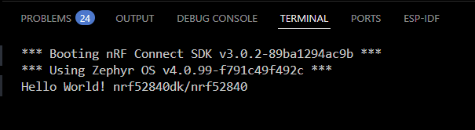

# Zephyr Custom Driver Tutorial — Button Driver Example (nRF Connect in VS Code)

This tutorial walks you through creating a **custom GPIO button driver** in Zephyr RTOS from scratch, using only the **nRF Connect extension in VS Code**. Based off of this tutorial series  [Watch on YouTube](https://www.youtube.com/watch?v=vXAg_UbEurc&list=PLEBQazB0HUyTmK2zdwhaf8bLwuEaDH-52&index=6)  

---

## **Table of Contents**

- [Zephyr Custom Driver Tutorial — Button Driver Example (nRF Connect in VS Code)](#zephyr-custom-driver-tutorial--button-driver-example-nrf-connect-in-vs-code)
  - [**Table of Contents**](#table-of-contents)
  - [**1. Create a New Zephyr Project**](#1-create-a-new-zephyr-project)
    - [Open the nRF Connect Extension](#open-the-nrf-connect-extension)
    - [Choose a Project Template](#choose-a-project-template)
    - [Add a Build Configuration](#add-a-build-configuration)
  - [**2. Project Structure**](#2-project-structure)
    - [Inital Project File Structure](#inital-project-file-structure)
  - [**3. Add a Custom Driver Module**](#3-add-a-custom-driver-module)
    - [Explanation of Driver's Source File](#explanation-of-drivers-source-file)
    - [Create Driver's Header File](#create-drivers-header-file)
  - [**4. Create a Devicetree Binding**](#4-create-a-devicetree-binding)
  - [Explanation of Device Tree Binding](#explanation-of-device-tree-binding)
  - [**5. Module’s CMake Files**](#5-modules-cmake-files)
    - [**Module Layout**](#module-layout)
  - [**6. Create Kconfig Files in Module Directory**](#6-create-kconfig-files-in-module-directory)
  - [**7. Create the Device Tree Overlay**](#7-create-the-device-tree-overlay)
    - [Key Points on Overlay](#key-points-on-overlay)
  - [**8. Modify the Application Code**](#8-modify-the-application-code)
  - [**9. Add the Driver to the prj.conf**](#9-add-the-driver-to-the-prjconf)
  - [**10. Build the Project**](#10-build-the-project)
  - [**11. Flash the Board**](#11-flash-the-board)
  - [**12. Open a Serial Monitor and Inspect Output**](#12-open-a-serial-monitor-and-inspect-output)
  - [**10. Troubleshooting**](#10-troubleshooting)
  - [**11. Useful Links**](#11-useful-links)
  - [**12. License**](#12-license)

---

## **1. Create a New Zephyr Project**

This section uses the **nRF Connect for VS Code** extension to create the base project.

### Open the nRF Connect Extension

1. Launch **VS Code**.
2. In the left sidebar (Activity Bar), click the **nRF Connect** icon.
3. Under the **Applications** tab, click **Create Application**.

### Choose a Project Template

- Select **Create New Application from Sample**.
- Choose the **Hello World** sample from the list.
- 
- Select a location for your project folder.
- Name the folder: `button_driver_example`.

### Add a Build Configuration

1. In the **nRF Connect** side panel, click **Add Build Configuration**.


2. Select your `button_driver_example` folder.
3. Choose your board (e.g., `nrf52840dk_nrf52840`).
4. Leave **Build Directory** as default.
5. Click **Build**.
6. Flash the board to ensure it is functional.

---

## **2. Project Structure**

### Inital Project File Structure

After creating the project, set up the folder structure like this:

```

button_driver_example/
├── boards/        # Devicetree     overlays
├── modules/       # Custom driver code
├── src/           # Application main code
├── CMakeLists.txt
└── README.md

```

You can create folders by **right-clicking** in the VS Code Explorer panel and selecting **New Folder**.

---

## **3. Add a Custom Driver Module**

1. Inside `modules/`, create a new folder `button/drivers/button`.
2. Add two files:
   - `button.c` → driver source file implementation
   - `button.h` → driver header file implementation
3. Example `button.c`:

```c
// Bind this driver to Devicetree nodes whose `compatible` matches "custom,button".
// Zephyr uses DT_DRV_COMPAT with DT_* macros (e.g., DT_DRV_INST) to connect code
// to the correct devicetree nodes at build time.
#define DT_DRV_COMPAT custom_button

#include <errno.h>
#include <zephyr/logging/log.h>
#include <zephyr/drivers/gpio.h>
#include "button.h"

// Registers a log module named "button". The effective log level is controlled by Kconfig
// (e.g., LOG_DEFAULT_LEVEL or per-module settings).
LOG_MODULE_REGISTER(button);

/*
 * Driver init function
 * --------------------
 * Called by the device model when the device instance is created (from DEVICE_DT_INST_DEFINE).
 * We:
 *  1) Fetch the instance's const configuration (dev->config), which we defined below.
 *  2) Verify the GPIO controller is ready (gpio_is_ready_dt).
 *  3) Configure the GPIO pin as input (gpio_pin_configure_dt).
 *
 * Returns:
 *   0 on success
 *  <0 on error (e.g., -ENODEV when the controller isn't ready)
 */
static int button_init(const struct device *dev)
{
    // `button_config` is our per-instance constant configuration (declared later).
    const struct button_config *cfg = dev->config;

    // Ensure the underlying GPIO controller described by cfg->btn.port is initialized and ready.
    if (!gpio_is_ready_dt(&cfg->btn)) {
        LOG_ERR("GPIO controller not ready");
        return -ENODEV;
    }

    // Configure the pin direction and flags from devicetree (e.g., pull-up, active-low).
    return gpio_pin_configure_dt(&cfg->btn, GPIO_INPUT);
}

/*
 * API method: get current button state
 * ------------------------------------
 * Reads the digital input and returns it as 0/1 in *state.
 *
 * Notes:
 *  - If the pin is marked active-low in devicetree, Zephyr automatically applies the
 *    polarity when using *_dt helpers, so `gpio_pin_get_dt` yields logical state.
 *  - On error, gpio_pin_get_dt returns a negative errno.
 */
static int button_state_get(const struct device *dev, uint8_t *state)
{
    const struct button_config *cfg = dev->config;

    // Read the pin value (logical level after active-low translation, if any).
    int val = gpio_pin_get_dt(&cfg->btn);
    if (val < 0) {
        LOG_ERR("Failed to read pin (%d)", val);
        return val; // Propagate errno
    }

    *state = (uint8_t)val; // 0 or 1
    return 0;
}

/*
 * Driver API vtable
 * -----------------
 * This exposes the driver's callable methods to application code via `device_get_binding`
 * or by referencing a devicetree-bound device. The struct shape is defined in your
 * `button.h` as `struct button_api`.
 */
static const struct button_api button_api_funcs = {
    .get = button_state_get,
};

/*
 * Instance definition macro
 * -------------------------
 * For each matching devicetree node (status = "okay"), we:
 *   1) Build a const `button_config` struct populated from devicetree:
 *      - GPIO spec is pulled via `GPIO_DT_SPEC_GET(DT_DRV_INST(inst), gpios)`.
 *      - `id` is just the instance number for convenience.
 *   2) Create a Zephyr device instance with DEVICE_DT_INST_DEFINE:
 *      - Name is auto-derived from the node label.
 *      - `button_init` is the init function that will run at boot.
 *      - No runtime data struct (NULL) since we only need const config.
 *      - `POST_KERNEL` init level, with GPIO init priority.
 *      - `button_api_funcs` is the vtable we expose.
 */
#define BUTTON_DEFINE(inst) \
    /* Per-instance constant configuration from Devicetree */ \
    static const struct button_config button_config_##inst = { \
        .btn = GPIO_DT_SPEC_GET(DT_DRV_INST(inst), gpios), \
        .id  = inst, \
    }; \
    /* Create the Zephyr device for this DT instance */ \
    DEVICE_DT_INST_DEFINE(inst,                  /* instance handle */ \
                          button_init,           /* init fn */ \
                          NULL,                  /* pm/device PM or release fn (none) */ \
                          NULL,                  /* runtime data (none) */ \
                          &button_config_##inst, /* const config */ \
                          POST_KERNEL,           /* init level */ \
                          CONFIG_GPIO_INIT_PRIORITY, /* init prio */ \
                          &button_api_funcs);    /* API vtable */

/*
 * Generate instances
 * ------------------
 * Expands BUTTON_DEFINE(inst) for every devicetree node whose:
 *   - compatible = "custom,button" (via DT_DRV_COMPAT)
 *   - status = "okay"
 *
 * This means you can declare multiple buttons in your board overlay and each
 * will become its own `struct device` with its own config.
 */
DT_INST_FOREACH_STATUS_OKAY(BUTTON_DEFINE)

```

### Explanation of Driver's Source File
Devicetree → Config: GPIO_DT_SPEC_GET(DT_DRV_INST(inst), gpios) pulls the pin + flags you declared in your .overlay/binding into a typed gpio_dt_spec.

Init timing: POST_KERNEL ensures GPIO drivers are up before your button_init runs.

API surface: Your struct button_api lets app code call button->get(...) uniformly, regardless of which instance or pin it’s bound to.

Multiple instances for free: Add more custom,button nodes in DT; the DT_INST_FOREACH_STATUS_OKAY macro spits out one device per node automatically.

### Create Driver's Header File

4. Example `button.h`:

```c
#ifndef ZEPHYR_DRIVERS_BUTTON_H_
#define ZEPHYR_DRIVERS_BUTTON_H_

/*
 * Button driver public interface
 * ------------------------------
 * This header exposes:
 *  - The driver's API vtable shape (`struct button_api`)
 *  - The per-instance constant configuration (`struct button_config`)
 *
 * The device instances themselves are generated in the .c file via
 * DEVICE_DT_INST_DEFINE and DT_INST_FOREACH_STATUS_OKAY, so application
 * code typically:
 *   1) gets a `const struct device *` for a button instance (e.g., by label),
 *   2) calls the API method(s) via the device's API vtable.
 */

#include <zephyr/device.h>        // struct device declaration
#include <zephyr/drivers/gpio.h>  // struct gpio_dt_spec

#ifdef __cplusplus
extern "C" {
#endif

/*
 * struct button_api
 * -----------------
 * Driver "vtable" shared by all button instances.
 *
 * Each method takes a `const struct device *dev` corresponding to a specific
 * devicetree-backed instance. The implementation is provided by the driver
 * (see button.c) and assigned in a `static const struct button_api`.
 */
struct button_api {
    /**
     * @brief Get current logical button state.
     *
     * Reads the configured GPIO and returns 0 or 1 in @p state.
     * If the pin is marked active-low in devicetree, Zephyr's *_dt helpers
     * account for polarity so the returned value is already logical.
     *
     * @param dev   Button device instance.
     * @param state Out parameter: 0 (released) or 1 (pressed).
     *
     * @retval 0        on success
     * @retval -errno   on failure (e.g., -EIO)
     */
    int (*get)(const struct device *dev, uint8_t *state);
};

/*
 * struct button_config
 * --------------------
 * Per-instance, compile-time configuration populated from devicetree.
 * This is stored in flash (const) and referenced by `dev->config`.
 *
 * Fields:
 *  - btn : Fully-typed GPIO spec (port, pin, flags) derived from DT
 *  - id  : Optional numeric identifier (DT instance index), handy for logs
 */
struct button_config {
    struct gpio_dt_spec btn;
    uint32_t id;
};

#ifdef __cplusplus
}
#endif

#endif /* ZEPHYR_DRIVERS_BUTTON_H_ */

```

---

## **4. Create a Devicetree Binding**

1. In `modules/button` make a new folder `dts/bindings/`, create a file called `custom,button.yaml`:

```yaml
# Devicetree binding for a custom GPIO button
# -------------------------------------------
# This file tells Zephyr's devicetree compiler:
#   1) What the `compatible` string is for this driver
#   2) What properties must be present in each node
#
# When a devicetree node has `compatible = "custom,button"`, Zephyr will:
#   - Validate that it matches this schema
#   - Make the node's properties accessible via DT macros (e.g., GPIO_DT_SPEC_GET)
#   - Allow DT_INST_FOREACH_STATUS_OKAY() to iterate over all "custom,button" nodes

description: Custom GPIO button

# `compatible` string — must match the DT_DRV_COMPAT in your driver source
compatible: "custom,button"

properties:
  # `gpios` is a standard Zephyr devicetree property name for referencing a GPIO controller.
  # It is a phandle-array, meaning it contains:
  #   - a phandle to the GPIO controller node (&gpioX)
  #   - the pin number
  #   - flag bits (pull-up, active-low, etc.)
  gpios:
    type: phandle-array
    required: true  # Every node with this compatible MUST define `gpios`

```

2. In `modules/button` make a new folder `zephyr` containing `module.yaml`

```yaml
# Zephyr module manifest
# ----------------------
# This file tells the Zephyr build system how to treat this folder as an
# external module. It allows you to:
#   - Add custom CMake logic
#   - Provide Kconfig options
#   - Add new devicetree bindings
#
# The module system is what lets Zephyr pick up your driver, its Kconfig,
# and its DTS bindings automatically when you include this module in a build.

# Name of this module (used internally by the Zephyr build system).
# Should be unique across all modules in the build.
name: button

build:
  # Path to the CMakeLists.txt file for this module.
  # A value of "." means "look in the same directory as this module.yaml".
  cmake: .

  # Path to the Kconfig file for this module.
  # This Kconfig file will be merged into the build's menuconfig.
  kconfig: Kconfig

  settings:
    # Root directory for devicetree bindings provided by this module.
    # This allows your custom `custom,button.yaml` binding to be found
    # without modifying Zephyr's main dts/bindings tree.
    dts_root: .

```

## Explanation of Device Tree Binding

name: button → This is the module name Zephyr will list when it discovers modules via west.

cmake: . → Ensures the CMake in your module root is executed, so the driver source gets compiled.

kconfig: Kconfig → Makes your driver’s Kconfig options available in menuconfig and prj.conf.

dts_root: . → Lets Zephyr find your custom DTS binding (custom,button.yaml) in your module instead of having to put it inside Zephyr’s own source tree.

## **5. Module’s CMake Files**

This module uses Zephyr’s CMake helpers to compile the driver and link it into the application automatically.
Zephyr’s build system discovers this module from `module.yaml`, then executes each `CMakeLists.txt` file starting at the module root and working down into subdirectories.

---

### **Module Layout**

```plaintext
modules/
└── button/
    ├── module.yaml                  # Tells Zephyr this folder is a module
    ├── CMakeLists.txt                # Module root CMake
    ├── Kconfig                       # Kconfig options for enabling the driver
    ├── dts/
    │   └── bindings/
    │       └── custom,button.yaml    # Devicetree binding
    └── drivers/
        ├── CMakeLists.txt
        └── button/
            ├── CMakeLists.txt        # Driver library CMake
            ├── button.c              # Driver source
            └── button.h              # Driver header

```

Note: Each directory that contributes source files to Zephyr needs its own CMakeLists.txt to tell CMake what to build.

Start by creating a `CMakeLists.txt` file in `modules/button/drivers/button`

```CMake
# Declares the current directory as a Zephyr library
# If no name is given, the name is derived from the directory name
zephyr_library()

# List the source code files for the library
zephyr_library_sources(button.c)

# Add header files to the CMake search directories
zephyr_include_directories(.)

```

CMake in `modules/button/drivers/`

```CMake
# Custom Zephyr function that imports the button/ subdirectory if the Kconfig
# option CUSTOM_BUTTON is defined
add_subdirectory_ifdef(CONFIG_CUSTOM_BUTTON button)

```

CMake in `modules/button`

```CMake
# Include the required subdirectories
add_subdirectory(drivers)

# Add subdirectories to the compiler's include search path (.h files)
zephyr_include_directories(drivers)

```

Finally modify your top level CMakeLists.txt to incude the out of tree module.

```Cmake
cmake_minimum_required(VERSION 3.20.0)

# Must be before find_package(Zephyr ...)
set(ZEPHYR_EXTRA_MODULES "${CMAKE_CURRENT_SOURCE_DIR}/modules/button")

find_package(Zephyr REQUIRED HINTS $ENV{ZEPHYR_BASE})
project(button_driver_example)

target_sources(app PRIVATE src/main.c)

```

## **6. Create Kconfig Files in Module Directory**

The Kconfig files allows the Zephyr kernel and subsystems to be configured at build time. We add Kconfig files to our button driver to allow it to be turned on and off in the projects prj.conf and through menuconfig

Start in the `modules/button/drivers/button` directory and add the firsts Kconfig.

```Kconfig
# Create a new option in menuconfig
config CUSTOM_BUTTON
    bool "Custom button"
    default n       # Set the driver to be disabled by default
    depends on GPIO # Make it dependent on GPIO driver
    help
        Enable the custom button driver.

```

In `modules/button/drivers`...

```Kconfig
rsource "button/Kconfig" #Point to Kconfig in subdirectory

```

In `modules/button`

```Kconfig
rsource "drivers/Kconfig" #Point to Kconfig in subdirectory

```

Confirstm that your file structure matches this:

```text
modules
\---button
    |   CMakeLists.txt
    |   Kconfig
    |
    +---drivers
    |   |   CMakeLists.txt
    |   |   Kconfig
    |   |
    |   \---button
    |           button.c
    |           button.h
    |           CMakeLists.txt
    |           Kconfig
    |
    +---dts
    |   \---bindings
    |           custom,button.yaml
    |
    \---zephyr
            module.yaml

```

## **7. Create the Device Tree Overlay**

```c
/ {
    // 'aliases' create short, friendly names that can be used in code
    // to refer to specific Devicetree nodes.
    // Here, 'my-button-1' maps to the node label &button_1,
    // and 'my-button-2' maps to &button_2.
    aliases {
        my-button-1 = &button_1;
        my-button-2 = &button_2;
    };

    // This is a custom node grouping your button devices.
    // The node name is 'custom-buttons', and the label is 'custom_buttons'.
    // Labels (like 'custom_buttons') allow referencing this node in code if needed.
    custom_buttons: custom-buttons {

        // First button definition:
        // Label 'button_1' allows you to reference it elsewhere (like in aliases).
        // The node name 'custom_button_1' is arbitrary but typically descriptive.
        button_1: custom_button_1 {
            // 'compatible' must match what your driver registers for in its
            // DEVICE_DT_INST_DEFINE macro. It tells Zephyr which driver
            // should handle this device.
            compatible = "custom,button";

            // 'gpios' defines the GPIO controller and pin for this button:
            //   &gpio0 → GPIO controller node (from SoC Devicetree)
            //   11     → pin number
            //   (GPIO_PULL_UP | GPIO_ACTIVE_LOW) → pin configuration flags
            gpios = <&gpio0 11 (GPIO_PULL_UP | GPIO_ACTIVE_LOW)>;

            // Marks the device as enabled in the Devicetree so Zephyr builds it in.
            status = "okay";
        };

        // Second button definition (same structure as button_1).
        button_2: custom_button_2 {
            compatible = "custom,button";
            gpios = <&gpio0 12 (GPIO_PULL_UP | GPIO_ACTIVE_LOW)>;
            status = "okay";
        };
    };
};

```

### Key Points on Overlay

- ensure that the compatible proprety matches the name in you `dts/bindings/custom,button.yaml` and `button.c` file in the `module` directory (in `button.c`, `#define DT_DRV_COMPAT custom_button`)
- Note that in `GPIO_DT_SPEC_GET()` you can assign the button to be either active low or active high depending on your requirements
- Adding an alias will allow the app code to use `DEVICE_DT_GET(DT_ALIAS(my_button_1))` instead of hardcoding the path to the node.

## **8. Modify the Application Code**


1. In `src/main.c`, write the application code

```c
#include <stdio.h>
#include <zephyr/kernel.h>     // k_msleep(), printk()
#include <zephyr/device.h>     // struct device, device_is_ready()
#include "button.h"            // your driver's public API: struct button_api, prototypes

// Poll period (ms)
static const int32_t sleep_time_ms = 50;

// Get device pointers from Devicetree aliases.
// DT_ALIAS(my_button_1) resolves to &button_1 from your overlay,
// and DEVICE_DT_GET(...) gives you a *const struct device for that node.
const struct device *btn_1 = DEVICE_DT_GET(DT_ALIAS(my_button_1));
const struct device *btn_2 = DEVICE_DT_GET(DT_ALIAS(my_button_2));

int main(void)
{
    int ret;
    uint8_t state_1;
    uint8_t state_2;

    // Sanity-check that the devices were created & initialized by your driver.
    // This returns false if:
    //  - the node is disabled (status != "okay"),
    //  - init function failed,
    //  - or probe order hasn’t brought it up yet.
    if (!(device_is_ready(btn_1) && device_is_ready(btn_2))) {
        printk("Error: buttons are not ready\r\n");
        return 0;
    }

    // Grab the driver's vtable (API) from any one instance.
    // In your driver .c, DEVICE_DT_INST_DEFINE(..., .api = &button_api_funcs)
    // stores a pointer to your API struct into dev->api.
    // Casting here matches your public header's definition.
    const struct button_api *btn_api = (const struct button_api *)btn_1->api;

    // Main poll loop
    while (1) {
        // Call your driver's "get" method via the API vtable.
        // Signature typically: int (*get)(const struct device *dev, uint8_t *state)
        // Your driver should write 0/1 (released/pressed) into *state (or whatever you defined).
        ret = btn_api->get(btn_1, &state_1);
        if (ret < 0) {
            printk("Error (%d): failed to read button 1 pin\r\n", ret);
            // continue so we still attempt button 2 next iteration
            continue;
        }

        ret = btn_api->get(btn_2, &state_2);
        if (ret < 0) {
            printk("Error (%d): failed to read button 2 pin\r\n", ret);
            continue;
        }

        // Dump states (space-separated) so it’s easy to parse if needed
         printk("btn 1 state: %u, btn 2 state: %u\r\n", state_1, state_2);

        // Simple debounce-ish polling interval (actual debounce should be in the driver
        // or handled here with timing/edge detection depending on your design goals).
        k_msleep(sleep_time_ms);
    }

    return 0;
}

```

## **9. Add the Driver to the prj.conf**

In the root directory of your project, enable the driver.

```prj.conf
CONFIG_CUSTOM_BUTTON=y
CONFIG_LOG=y
CONFIG_LOG_DEFAULT_LEVEL=3
CONFIG_GPIO=y

```

---

## **10. Build the Project**

1. In the **nRF Connect** side panel, find your build configuration.
2. Right click on your previous build and select **Edit Build Configuration**.
   Ensure that you have your current Board Target selected.
   
3. In **Extra Devicetree overlays** add the overlay file in your `boards` directory 
4. Click **Generate and Build**

Note that if your having issues building the firstst place to look would be to ensure you have added your overlay to the project.

You can check the `.dts` file generated by Zephyr which will include your overlay and button driver configuration information.

The file can be found in `root\build\button_driver_example\zephyr`


---

## **11. Flash the Board**

1. Connect your board via USB.
2. In the build configuration panel, click **Flash**.

---

## **12. Open a Serial Monitor and Inspect Output**

1. In the **nRF COnnect** extension under **Connected Devices** Open the serial terminal to view the board's output

---

2. The button state should turn to 1 when a button is pressed


---

## **10. Troubleshooting**

- **No output** → Ensure `CONFIG_LOG=y` in `prj.conf`.
- **Build errors** → Check your `CMakeLists.txt` paths.
- **Driver not working** → Verify your GPIO pin in the overlay file.
- Check the **button_driver_example** to ensure your file directory matches at the driver is being recognized by zephyr.

---

## **11. Useful Links**

1. **Shawn Hymel — "Introduction to Zephyr Part 6: How to Write a Device Driver" (DigiKey)**  
   [Watch on YouTube](https://www.youtube.com/watch?v=vXAg_UbEurc&list=PLEBQazB0HUyTmK2zdwhaf8bLwuEaDH-52&index=6)  
   - This tutorial series is an excellent starting point for understanding the basics of drivers and how they integrate with **Kconfig**, **CMake**, and the **Devicetree**.

2. **Zephyr Devicetree Guide**  
   - Official guide on Devicetree implementation:  
     [https://docs.zephyrproject.org/latest/build/dts/index.html#devicetree-guide](https://docs.zephyrproject.org/latest/build/dts/index.html#devicetree-guide)

3. **Zephyr Device Driver Model Documentation**  
   - Comprehensive reference for Zephyr’s driver model:  
     [https://docs.zephyrproject.org/latest/kernel/drivers/index.html](https://docs.zephyrproject.org/latest/kernel/drivers/index.html)

---

## **12. License**

MIT License — feel free to use and modify.
